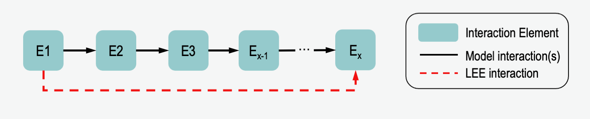

VIOLIN Function References
*****************************************

Input and Output Functions (:py:mod:`violin.in_out`)
=======================================================

This section details the functions which handle the input files and output of VIOLIN.

For more information on the types of accepted inputs, see `BioRECIPE <https://melody-biorecipe.readthedocs.io/en/latest/index.html>`_.

Functions
^^^^^^^^^^^^

.. autofunction:: violin.in_out.preprocessing_model

.. autofunction:: violin.in_out.preprocessing_reading

.. autofunction:: violin.in_out.output

Defaults
--------
Default Reading Columns

.. literalinclude:: ../src/violin/in_out.py
    :language: python
    :lines: 85-91
    :lineno-start: 85

Default Model Columns (From BioRECIPE format)

.. literalinclude:: ../src/violin/in_out.py
    :language: python
    :lines: 69-72
    :lineno-start: 69

Formatting Functions (:py:mod:`violin.formatting`)
=======================================================

This section details the formatting functions of VIOLIN, used during model and interaction list.

The formatting, as it:

* identifies duplicate interactions in the interactions list,
* counts the number of times an interaction was found in the interactions list (:ref:`scoring:Evidence Score`),
* creates a unique identifier for every element based on their name, type, subtype, and compartment ID.

Functions
^^^^^^^^^^^^

.. autofunction:: violin.formatting.evidence_score

.. autofunction:: violin.formatting.get_listname

Network Functions (:py:mod:`violin.network`)
=======================================================

This page details how paths are defined and found in the model in VIOLIN.
Because of the compact nature of the BioRECIPES model format,
the model must be converted into a node-edge list for use with the
`NetworkX <https://networkx.github.io/documentation/stable/index.html/>`_ Python package.

One special feature of VIOLIN is its ability to compare interactions from machine reading output, or interaction set from database, to
paths that exist in the model. For two nodes, *E1* and *Ex*, an iIS may exist with *E1* regulating
*Ex*. If in the model there is a path of multiple interactions where *E1* regulates *E2* which
regulates *E3* etc. to *Ex*, VIOLIN can identify this, and compare the iIS to this whole path.
And indirect iIS may be a :ref:`path corroboration <scoring:Corroborations>` to the model interaction, or a direct iIS may
be a :ref:`specification <scoring:Corroborations>`, identifying a more direct relationship between 2 nodes than is given in
the model. This functionality reduces the number of false extensions.

Functions
^^^^^^^^^^^^

.. autofunction:: violin.network.node_edge_list

.. autofunction:: violin.network.path_finding

Numeric Functions (:py:mod:`violin.numeric`)
==============================================

This section describes the numeric operators of VIOLIN.

#. searching for an element in the machine reading output or the interactions set from databases,
#. comparing attributes, identifying whether a given attribute

   * matches exactly attribute in a corresponding model interaction,
   * is missing where a model interaction attribute is present,
   * is present where a model interaction attribute is missing,
   * mismatch from an attribute in a corresponding model interaction.

Both functions return numerical values to represent the outcome of the function.

Functions
^^^^^^^^^^^^^

.. autofunction:: violin.numeric.get_attributes

.. autofunction:: violin.numeric.find_element

.. autofunction:: violin.numeric.compare

Scoring (:py:mod:`violin.scoring`)
==================================

This part details the scoring functions of VIOLIN

Match Score
^^^^^^^^^^^^^

The Match Score (S\ :sub:`M`\) measures how many new nodes are found in the interactions set with respect to the model.
For an interaction in the Interactions Set (iIS) **A → B**, where **A** is the regulator and **B** is the
regulated node, this calculation considers 4 cases which determine the scoring outcome:

#. Both **A** and **B** are in the model
#. **A** is in the model, **B** is not
#. **B** is in the model, **A** is not
#. Neither **A** nor **B** are in the model

Default Match Level scores are given for the assumption that the user wants to extend a given model without
adding new nodes which may not be useful to the network. Thus, new regulators and new edges between model nodes are
considered most important.

Kind Score
^^^^^^^^^^^^^

The Kind Score (S\ :sub:`K`\) measures the edges of an iIS with respect to the model interaction.
The Kind Score easily identifies the classification of an interaction, as well as
searching for paths between nodes in the model when the iIS is identified as indirect.
Using the same assumption from the Match Level calculation, the Kind Score represents the following
scenarios:

+----------------------+--------------------------------------------------------+
|    Classification    |                       Definition                       |
+======================+========================================================+
|    Corroboration     |                   iIS matches model interaction        |
+----------------------+--------------------------------------------------------+
|      Extension       |       iIS contains information not found in model      |
+----------------------+--------------------------------------------------------+
|     Contradiction    |               iIS disputes information in MI           |
+----------------------+--------------------------------------------------------+
|        Flagged       |                 Must be judged manually                |
+----------------------+--------------------------------------------------------+

And within each classification, there are further sub-classifications.
These subclassifications allow for more detailed scoring, if the user wishes.

Corroborations
^^^^^^^^^^^^^^
    Strong Corroboration: iIS matches MI exactly

    Weak Corroboration Type 1: iIS matches direction, sign, connection type, and node type, of a model interaction
    but is missing additional attributes

    Weak Corroboration Type 2: an indirect iIS matches direction and sign of direct model interaction
    with non-contradictory attributes

    Weak Corroboration Type 3: an indrect iIS matches the direction and sign of a *path* in the model
    with non-contradictory attributes

Extensions
^^^^^^^^^^
    Full Extension: Neither source nor target of the iIS is in the model

    Hanging Extension: The target of the iIS is in the model

    Internal Extension: Both the source and target of the iIS are in the model,
    but there is no model interaction between them

    Specification: iIS contains more information (attributes) than MI, or
    shows a direct relationship compared to Model Path

Contradictions
^^^^^^^^^^^^^^
    Direction Contradiction: The target and source of the iIS correspond to
    the source and target of the model interaction, respectively

    Sign Contradiction: The regulation sign of the iIS is opposite of the corresponding
    model interaction (e.g. the iIS shows a positive regulation where the model interaction shows negative)

    Attribute Contradiction: One or more of the iIS node attributes differs from that found
    in the corresponding model interaction

Flagged
^^^^^^^
    Flagged Type 1: Mismatched Direction and non-contradictory Other
    Attributes with a Direct connection type in the model

    Flagged Type 2: An iIS with a corresponding path which has one or
    more Mismatched Attributes

    Flagged Type 3: An iIS which is a self-regulation based on the definition
    of model element
    (e.g. iIS has caspase-8 --> caspase-3, but the model considers cas-8 and cas-3 to be the same element)

Evidence Score
^^^^^^^^^^^^^^^^^
The Evidence Score (S\ :sub:`E`\) is a measure of how many times an iIS is found. In the :py:func:`violin.formatting.evidence_score` function, column names
are defined to determine how the function determines duplicates. For example, the Evidence Score can be calculated by comparing all iIS attributes and all the columns of the interactions set.
So only an exact match between iISs will be counted as a duplicate. However, the user can also define fewer attributes, creating a more coarse-grained Evidence Score calculation.

Epistemic Value
^^^^^^^^^^^^^^^^^

In the NLP output, we sometimes receive an Epistemic Value (S\ :sub:`B`\), which is a measure
of the believability of an iIS. Zero, Low, Moderate, and High
believability correspond to numerical scores of 0.0, 0.33, 0.67, and 1.0, respectively.

Total Score
^^^^^^^^^^^^^^^^^
The total score (S\ :sub:`T`\) is calculated by

.. math:: S_T = [S_K + (S_E*S_M)]*S_B

Functions
^^^^^^^^^^^^^^^^^

.. autofunction:: violin.scoring.match_score

.. autofunction:: violin.scoring.kind_score

.. autofunction:: violin.scoring.epistemic_value

.. autofunction:: violin.scoring.score_reading

Visualization (:py:mod:`violin.visualize_violin`)
=================================================

VIOLIN's visualization function creates a visual summary of the VIOLIN
output, incuding total score, evidence score, and match score distributions.

The visualization function includes a filtering option, which can help the user make choices
on how to use the VIOLIN output. Visualization can be filtered by three possible metrics:

#. "%x" : Returns the top X% of iISs, by Total Score
#. "Se>y" : Returns all iISs with an Evidence Score greater than Y
#. "St>z" : Returns all iISs with a Total Score grater than Z

- When visualizing the total output, this function shows the score distributions by classification, as well as the classification distribution

- When visualizing output of a single classification, the classification distribution is replaced by the number of iISs given that classification

- When subcategories are identified in the Kind Score definition, additional plots of subcategory distribution are included

Class
^^^^^^^^^^^^^^^

.. autoclass:: violin.visualize_violin.ViolinPlot
    :members: get_pie_plots, get_summary_plots, get_category_summary

