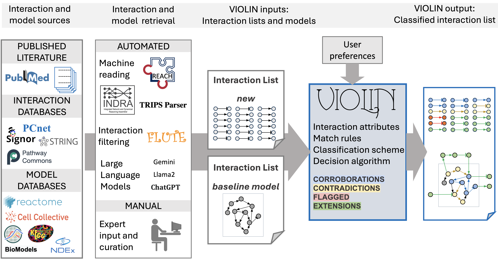

==================================
Welcome to VIOLIN's documentation!
==================================
.. image:: https://readthedocs.org/projects/melody-violin/badge/?version=latest
    :target: https://melody-violin.readthedocs.io/en/latest/?badge=latest
    :alt: Documentation Status
.. image:: https://mybinder.org/badge_logo.svg
    :target: https://mybinder.org/v2/gh/pitt-miskov-zivanov-lab/VIOLIN/HEAD?labpath=%2Fexamples%2Fuse_VIOLIN.ipynb

**VIOLIN (Versatile Interaction Organizing to Leverage Information in Networks)** is a tool that can automatically classify large sets of interactions such as those retrieved from literature by machine readers. These interactions are clasified with respect to another interaction set or a mechanistic model network.

VIOLIN Objectives
-----------------

1. To classify interaction lists, specifically with respect to finding the most useful information for modeling

2. To compare information from the literature to an existing model using multiple metrics and varying levels of detail

3. To carry out 1. and 2. on large amounts of information very quickly

VIOLIN Workflow
------------------

|
|
VIOLIN judges whether the new interactions support or further enrich the information in the model (*corroborations*), thereby verifying and curating the model. VIOLIN identifies gaps and issues in the knowledge, published information, and models (*contradictions*) and indicates that the newly obtained information requires further investigation (*flagged*). VIOLIN also provides new interactions for extending the models (*extensions*).

Further, VIOLIN has the capability to identify and search through paths within a model when comparing to new interaction lists, identifying new potential feedback and feed-forward loops. 

Finally, VIOLIN performs the comparison and classification of large new interaction lists within a given context at least three orders of magnitude faster than a human, thus enabling reliable high throughput modeling and curation tasks that would not be feasible otherwise.

.. toctree::
   :maxdepth: 1
   :caption: Contents

   legal
   installation
   files
   in_out
   formatting
   numeric
   network
   scoring
   utils
   visualization
   tutorials

Indices
-------

* :ref:`genindex`
