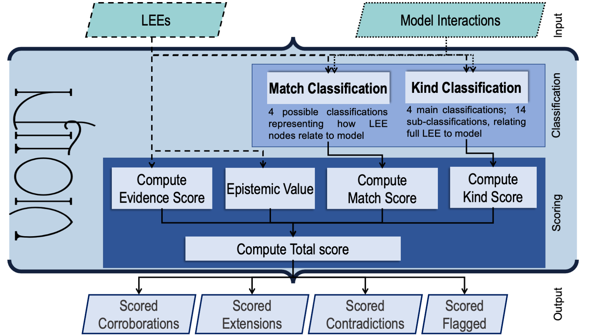

.. Violin documentation master file, created by
   sphinx-quickstart on Tue Nov 19 09:44:57 2019.
   You can adapt this file completely to your liking, but it should at least
   contain the root `toctree` directive.

==================================
Welcome to VIOLIN's documentation!
==================================
.. image:: https://readthedocs.org/projects/theviolin/badge/?version=latest
    :target: https://theviolin.readthedocs.io/en/latest/?badge=latest
    :alt: Documentation Status
.. image:: https://mybinder.org/badge_logo.svg
    :target: https://mybinder.org/v2/gh/pitt-miskov-zivanov-lab/VIOLIN/HEAD?labpath=%2Fexamples%2Fuse_VIOLIN.ipynb

*VIOLIN (Validating Interactions Of Likely Importance to the Network)*
is a tool used to automatically classify and judge literature-extracted
interactions curated from machine readers by comparing them to existing models.
This comparison can help identify key interactions for model extension.

As part of this comparison, VIOLIN assigns multiple numerical values to
each literature extracted event (LEE) representing the LEEs relationship to the model.
These individual scores cumulate into a Total Score, which can be used to quickly
judge how relevant and useful the LEE is to a given model.

VIOLIN Objectives
-----------------

1. To classify reading output, specifically with respect to finding the
most useful information for modeling

2. To compare information from the literature to an existing model using multiple metrics
at varying levels of detail

3. To carry out 1. and 2. on incredibly large amounts of machine reading output very quickly

VIOLIN Methodology
------------------

VIOLIN takes spreadsheets of formatted machine reading output and static models
as input and outputs the scored LEEs, separating them by their primary
classification: Corroboration, Contradiction, Extension, or Flagged.

Each biological interaction can be defined by a *source* node, and *target* node,
and a connecting *edge* between them. There may also be additional *attributes* that
present additional details. VIOLIN takes advantage of this definiton when making
its judgements.

.. image:: ToyExample.png
   :scale: 50 %
   :align: center

.. toctree::
   :maxdepth: 1
   :caption: Contents

   Legal
   installation
   files
   in_out
   formatting
   numeric
   network
   scoring
   visualization
   tutorials

Indices
-------

* :ref:`genindex`
