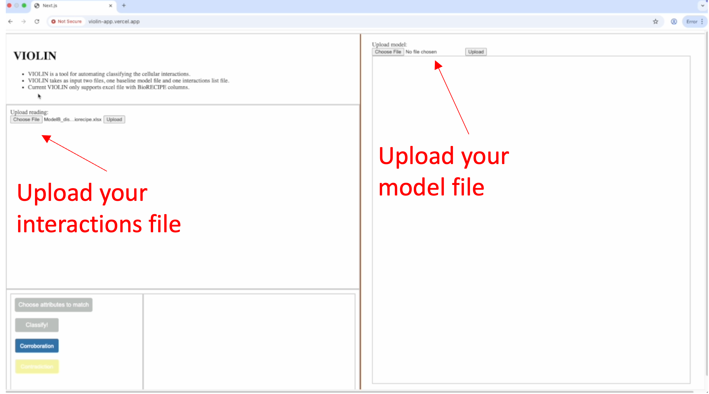
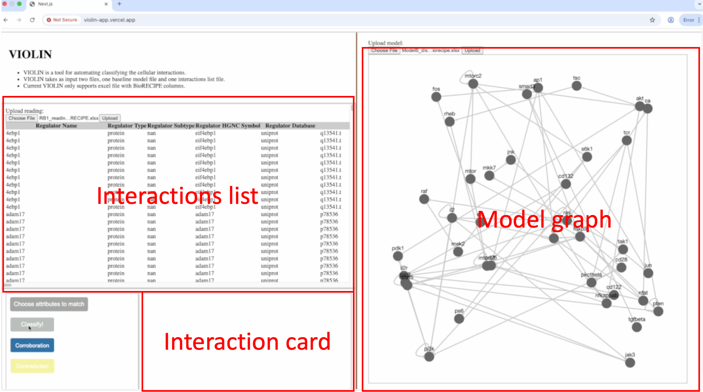
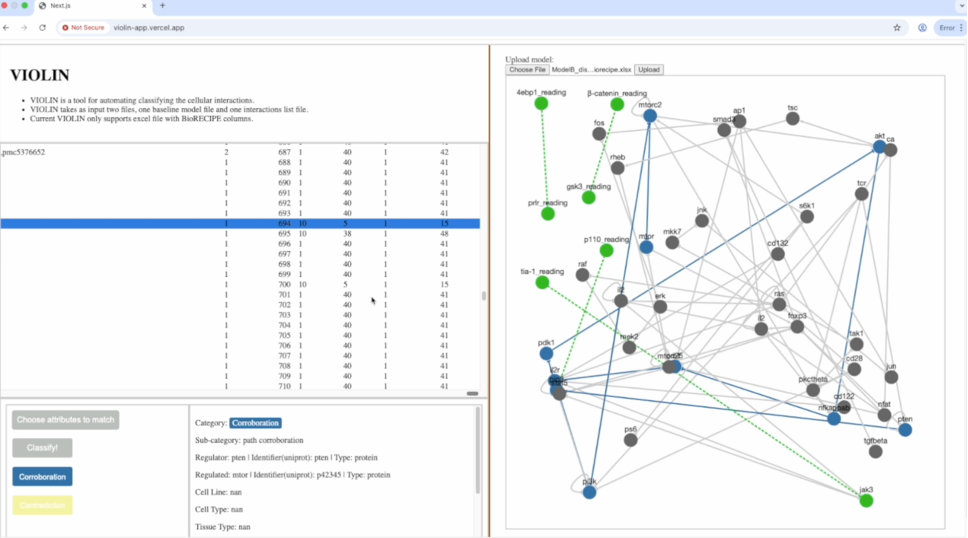
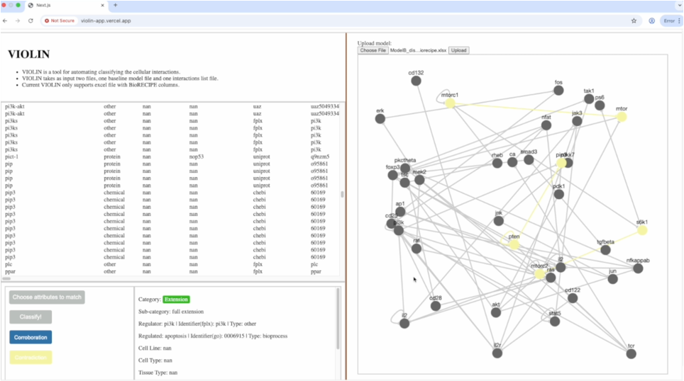

#############
Installation
#############

Dependencies
------------
VIOLIN requires Python version 3.7 or higher, as well as the
`pandas <https://pandas.pydata.org/>`_  and `NumPy <https://numpy.org/>`_ libraries.

Python can be installed from the `Python <https://www.python.org/downloads/>`_ website
for Mac or Windows OS.

For Mac OSX, Python can also be installed at the command line by:

.. code-block:: bash

   brew install python

Installing VIOLIN
-----------------
A copy of the VIOLIN repository can be downloaded from `Github <https://github.com/pitt-miskov-zivanov-lab/VIOLIN>`_,
or cloned through git at the command line:

.. code-block:: bash

   git clone https://github.com/pitt-miskov-zivanov-lab/VIOLIN.git

You will then need to run the `setup.py` file to use VIOLIN as a package:

.. code-block:: bash

   cd VIOLIN
   pip install -e .

VIOLIN GUI
----------

To use the user interface (UI) for VIOLIN, you will need to install the `npm`:
.. code-block:: bash 
   brew install npm

Then, you can follow the instructions to start the backend server:

.. code-block:: bash
   fastapi run main.py

and open a new terminal to start the front end UI: 

.. code-block:: bash
   npm run start

This will start the server on `localhost:8000` and the UI on `localhost:3000`.
After open the url `localhost:3000` in your browser, you can see the following page:

You can upload the BioRECIPE interaction file and the BioRECIPE model file by clicking the "Upload" button.

After uploading the files, you will likely see the interactions list and a graph for the baseline model. 

By selecting the interactions in the interaction list window, you can see the corresponding interaction in the interaction card.

To classify the interaction, you could specify the attributes you want to compare; the model will classify the interactions by those attributes besides the essential attributes.

After classification, you can render the classified result in the graph by clicking the corresponding interaction row:

The web page could also display the hits for the corroborated and contradicted interactions in the model:

