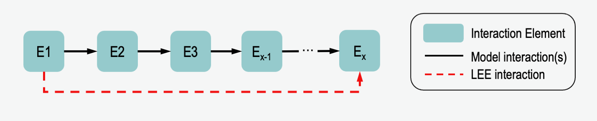

Network Functions (:py:mod:`violin.network`)
============================================

This page details how paths are defined and found in the model in VIOLIN.
Because of the compact nature of the BioRECIPES model format,
the model must be converted into a node-edge list for use with the
`NetworkX <https://networkx.github.io/documentation/stable/index.html/>`_ Python package.

One special feature of VIOLIN is its ability to compare interactions from machine reading output to
paths that exist in the model. For two nodes, *E1* and *Ex*, an LEE may exist with *E1* regulating
*Ex*. If in the model there is a path of multiple interactions where *E1* regulates *E2* which
regulates *E3* etc. to *Ex*, VIOLIN can identify this, and compare the LEE to this whole path.
And indirect LEE may be a :ref:`weak corroboration <scoring:Corroborations>` to the model interaction, or a direct LEE may
be a :ref:`specification <scoring:Extensions>`, identifying a more direct relationship between 2 nodes than is given in
the model. This functionality reduces the number of false extensions.

Functions
---------

.. currentmodule:: network
.. autofunction:: node_edge_list

.. currentmodule:: network
.. autofunction:: path_finding

Dependencies
------------
**Python**: `pandas <https://pandas.pydata.org/>`_
and `numpy <https://numpy.org/>`_ libraries,
`NetworkX <https://networkx.github.io/documentation/stable/index.html/>`_ package

**VIOLIN**: ``numeric`` module

Usage
-----
Use of the *path_finding* function in the *scoring.kind_score()* module: ::

    #If model does not contain interaction - check for path
    else:
        kinds.append(path_finding(model_df.loc[s_idx,'Variable'],model_df.loc[t_idx,'Variable'],
                     reg_sign,model_df,graph,kind_values,lee_cxn_type,reading_atts,attributes))
