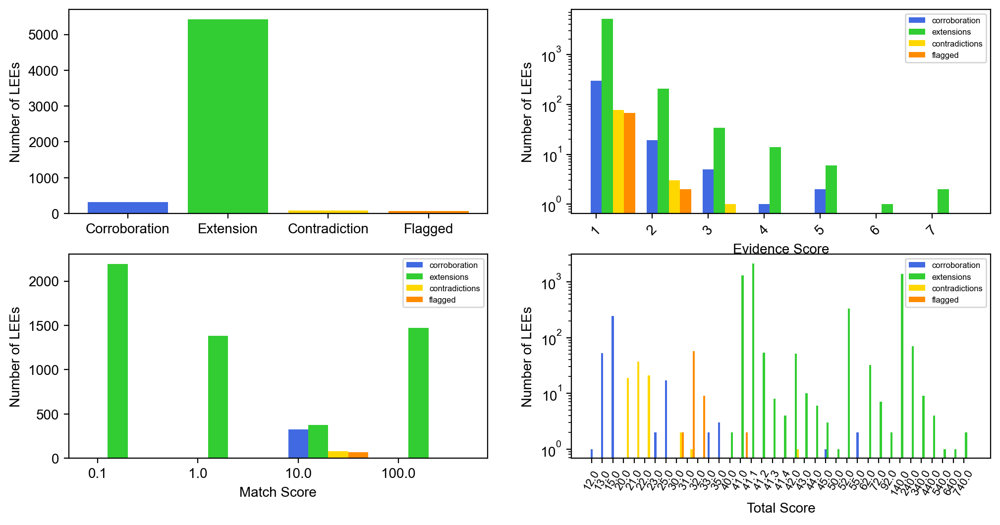
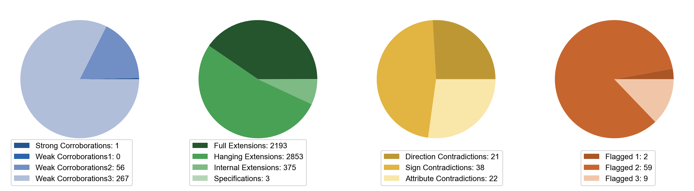
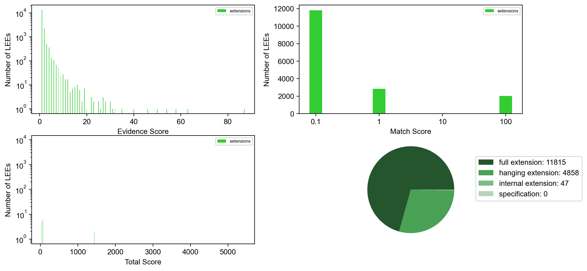

Visualization (:py:mod:`violin.visualize_violin`)
=================================================

VIOLIN's visualization function creates a visual summary of the VIOLIN
output, incuding total score, evidence score, and match score distributions.

The visualization function includes a filtering option, which can help the user make choices
on how to use the VIOLIN output. Visualization can be filtered by three possible metrics:

#. "%x" : Returns the top X% of LEEs, by Total Score
#. "Se>y" : Returns all LEEs with an Evidence Score greater than Y
#. "St>z" : Returns all LEEs with a Total Score grater than Z

- When visualizing the total output, this function shows the score distributions by classification, as well as the classification distribution

- When visualizing output of a single classification, the classification distribution is replaced by the number of LEEs given that classification

- When subcategories are identified in the Kind Score definition, additional plots of subcategory distribution are included

Functions
---------

.. currentmodule:: visualize_violin
.. autofunction:: visualize

Dependencies
------------
**Python**: `pandas <https://pandas.pydata.org/>`_  and matplotlib libraries

**VIOLIN**: none

Example output
--------------
Visualizing the total output ::

    visualize(match_dict, kind_dict, 'RA2_sub_TotalOutput.csv', filter_opt='100%')

Visualizing subcategories::

    kind_dict ={"strong corroboration" : 2,
                "weak corroboration1" : 1,
                "weak corroboration2" : 3,
                "weak corroboration3" : 5,
                "hanging extension" : 40,
                "full extension" : 41,
                "internal extension" : 42,
                "specification" : 30,
                "dir contradiction" : 10,
                "sign contradiction" : 11,
                "att contradiction" : 12,
                "flagged1" : 20,
                "flagged2" : 21,
                "flagged3" : 22}
    visualize(match_dict, kind_dict, 'RA2_sub_TotalOutput.csv', filter_opt='100%')

Visualizing an individual category (extensions) ::

    visualize(match_dict, kind_dict, 'RA2_sub_extensions.csv', filter_opt='100%')

